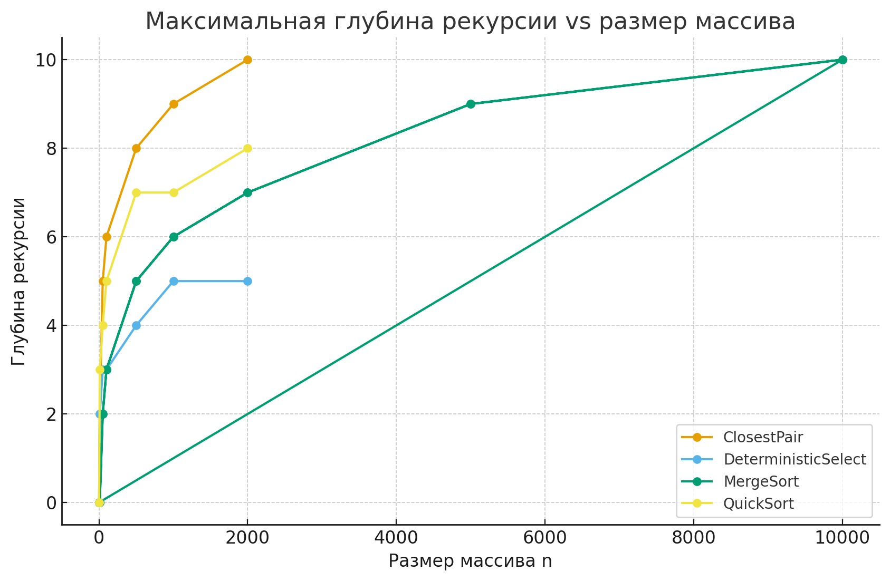

# Divide-and-Conquer Algorithms Report

## Implemented Algorithms

1. **MergeSort**
    - Cutoff = 16 → small arrays handled with InsertionSort.
    - Single buffer allocated and reused.
    - Recursive structure with depth tracking.

2. **QuickSort**
    - Random pivot (`java.util.Random`).
    - Tail recursion optimization: recurse on smaller part, loop on larger → O(log n) stack depth.

3. **Deterministic Select (Median-of-Medians)**
    - Groups of 5, median of medians chosen as pivot.
    - Recursion only in required side.

4. **Closest Pair of Points (2D)**
    - Sorted by x, recursive splitting.
    - Strip constructed and sorted by y.
    - At most 7–8 neighbors checked per point.

5. **MetricsRecorder**
    - Tracks comparisons, allocations, recursion depth, execution time.
    - Outputs results to CSV.

---

## Recurrence Relations

- **MergeSort**  
  T(n) = 2T(n/2) + Θ(n) → Θ(n log n).

- **QuickSort (Randomized)**  
  Expected T(n) = Θ(n log n), worst-case Θ(n²).

- **Deterministic Select**  
  T(n) = T(n/5) + T(7n/10) + Θ(n) → Θ(n).

- **Closest Pair**  
  T(n) = 2T(n/2) + Θ(n) → Θ(n log n).

---

## Experimental Results

Data from *metrics.csv*.

### Execution Time
 

### Comparisons

### Recursion Depth

---

## Theory vs Practice

- Asymptotic results confirmed by experiments.
- Constants affect performance (e.g. cutoff in MergeSort).
- Caching and GC introduce deviations at large n

## Conclusion

- The project successfully implements and evaluates four 
divide-and-conquer algorithms. Both theoretical analysis and experimental metrics confirm expected time complexities. Performance graphs highlight the influence of recursion strategies, cutoffs, and memory usage on efficiency.